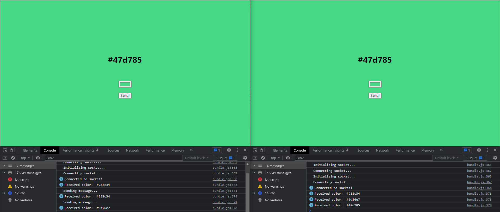

# RealTime Color Picker App
This project uses socket.io for communicating to backend

This project is using nodejs backend and before runing it, you should have backend.
You can clone the backend repo from here:  [`Backend Repo`](https://download-directory.github.io/?url=https%3A%2F%2Fgithub.com%2FKodluyoruz%2Ftaskforce%2Ftree%2Freact-patika%2Freact-patika%2Frealtime%2Frealtime-colors%2Fbackend)

 ## After you downloaded the backend, open it and run
 `npm start`
 ## After you started the backend, open frontent and run
 `npm start`

### Well done!

